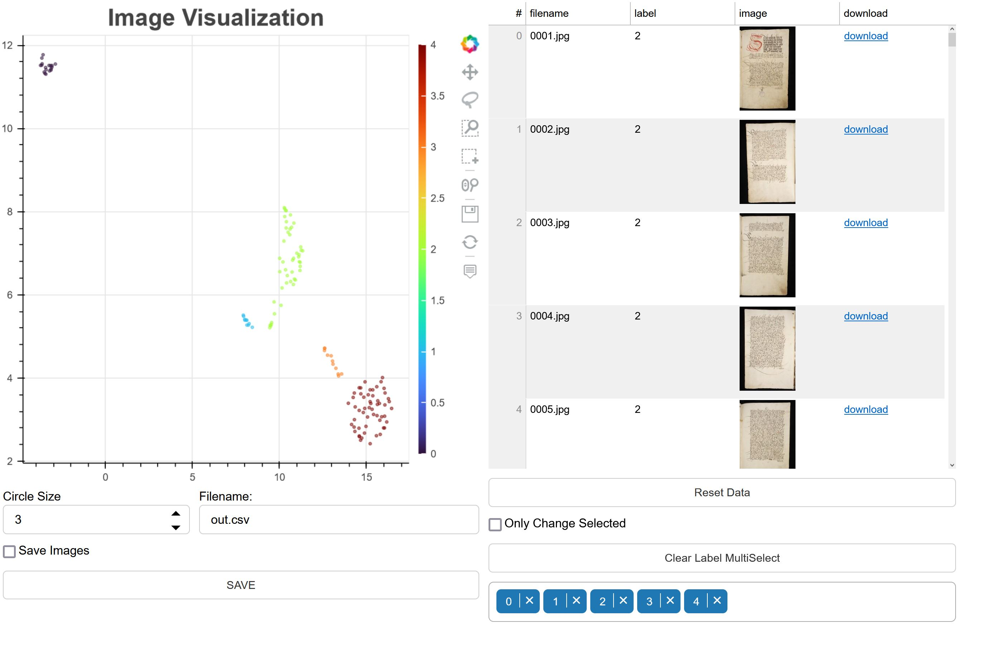

# Bulk Image Clustering

# About
This repository is built upon the work of [Vincent D. Warmerdam](https://github.com/koaning), specifically his [bulk](https://github.com/koaning/bulk) Python library.

The repository allows for you to leverage DocArray to grab all images from a directory. DocArray wraps around [timm](https://pypi.org/project/timm/) which allows one to easily change the models used for embedding images. Timm is used to embedd all images in the directory. The embeddings are flattened via [UMAP](https://umap-learn.readthedocs.io/en/latest/) and clusters are identified with [HDBScan](https://hdbscan.readthedocs.io/en/latest/how_hdbscan_works.html). For running these tasks, see demo.ipynb.

The DocArray data is exported as a CSV file and optionally pickled. The images are saved into the static subfolder of the specified application name (a subfolder in the main directory).

Once the files have been processed and the CSV file generated, the application can be run by executing:

```
bokeh serve e_codices --show --args demo.csv
```

You can replace "demo" with your own application name. In the demo notebook, you will find this already implemented with:

```
!bokeh serve demo --show --args demo.csv
```

You should see in your browser bokeh server:



# Files
```
project
│   README.md
│   demo.ipynb => Jupyter Notebook for processing directories of images
|   Home.py => Streamlit application for running demo.ipynb
|   results.csv => csv file with results used by bokeh server
│
└───demo_images => images for the demo
│
└───app_files (DO NOT DELETE)
│   │   main.py => main bokeh server application
│   │   utils.py => functions for the server
│
└───demo => demo application
│   │   main.py => main bokeh server application
│   │   utils.py => functions for the server
│   │
│   └───static => subfolder that holds the images for the server
│       │   ushmm_demo => images for the ushmm demo of the app
│
└───src
    │   utils.py => functions for demo.ipynb
```
