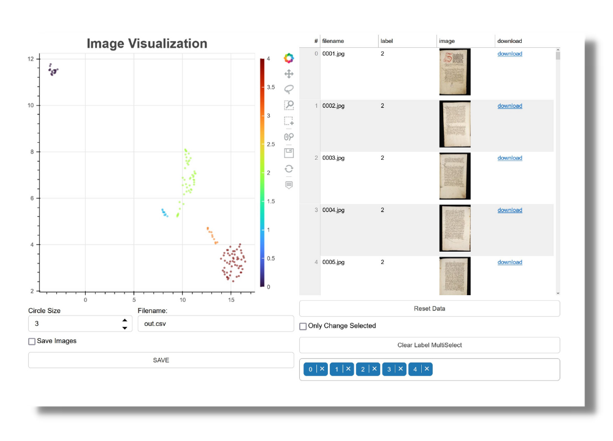

# Bulk Image Clustering

# About
This repository is built upon the work of [Vincent D. Warmerdam](https://github.com/koaning), specifically his [bulk](https://github.com/koaning/bulk) Python library.

The repository allows for you to leverage DocArray to grab all images from a directory. DocArray wraps around [timm](https://pypi.org/project/timm/) which allows one to easily change the models used for embedding images. Timm is used to embedd all images in the directory. The embeddings are flattened via [UMAP](https://umap-learn.readthedocs.io/en/latest/) and clusters are identified with [HDBScan](https://hdbscan.readthedocs.io/en/latest/how_hdbscan_works.html). For running these tasks, see demo.ipynb.

The DocArray data is exported as a CSV file and optionally pickled. The images are saved into the static subfolder of the specified application name (a subfolder in the main directory).

Once the files have been processed and the CSV file generated, the application can be run by executing:

```
bokeh serve e_codices --show --args demo.csv
```

You can replace "demo" with your own application name. In the demo notebook, you will find this already implemented with:

```
!bokeh serve demo --show --args demo.csv
```

You should see a bokeh server in your browser. If it does not load, try visiting: [http://localhost:5006/demo](http://localhost:5006/demo):



# The Server Features

## Plot
The top-left of the application houses the scatter plot. Each node in this graph represents an image embedding's position in 2-dimensional space. The closer two images are together, in theory, the closer in similarity the two images are. Some results may vary. The colors for the nodes correspond to specific labels generated by HDBScan.

## Plot Buttons
On the right side of the plot, the user will see 9 buttons.
### Bokeh Link
This is the standard bokeh icon that links to bokeh's docs

### Pan
When activated, pan allows the user to move the plot around

### Lasso Select
This allows the user to select items in the graph as a lasso

### Box Zoom
This allows you to zoom in by making a square

### Box Select
This allows the user to select images with a box

### Wheel Zoom
This allows the user to pan in and out with their mouse's wheel.

### Save
This will save the plot image only. To save the data, see below.

### Reset
This will reset the plot only. To reset the entire app, see below.

### Hover
When activated, this allows the user to hover over an image. A popup will display the image, it's name, and label.

## DataTable

In the top-right of the application is the DataTable. This table is dynamically populated by the images selected in the plot. This DataTable populates dynamically based on the nodes selected in the graph and the labels selected in the MultiSelect menu.

## Save Data
In the bottom left of the application, the user can download the data. The Filename will save as a CSV file. If "Save Images" is selected, the images will be saved in the directory as a zip file with the same name as the CSV file. Click Save to save the data.

## Reset Data
Reset Data will reset the entire application.

## Only Change Selected
This allows you to enable or disable the labels in the MultiSelect to appear only if they are already selected in the plot.

## MultiSelect Labels
This allows the user to select or deselect specific labels. This will be populated dynamically based on the data selected in the plot. It will also function in reverse.

# Files
```
project
│   README.md
│   demo.ipynb => Jupyter Notebook for processing directories of images
|   Home.py => Streamlit application for running demo.ipynb
|   results.csv => csv file with results used by bokeh server
│
└───demo_images => images for the demo
│
└───app_files (DO NOT DELETE)
│   │   main.py => main bokeh server application
│   │   utils.py => functions for the server
│
└───demo => demo application
│   │   main.py => main bokeh server application
│   │   utils.py => functions for the server
│   │
│   └───static => subfolder that holds the images for the server
│       │   ushmm_demo => images for the ushmm demo of the app
│
└───src
    │   utils.py => functions for demo.ipynb
```
